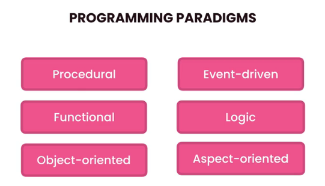
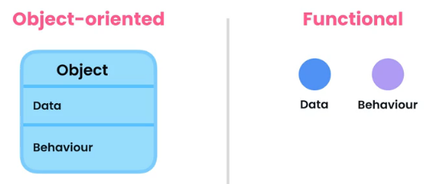
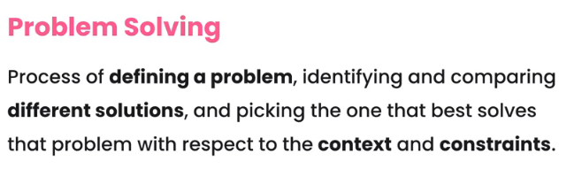
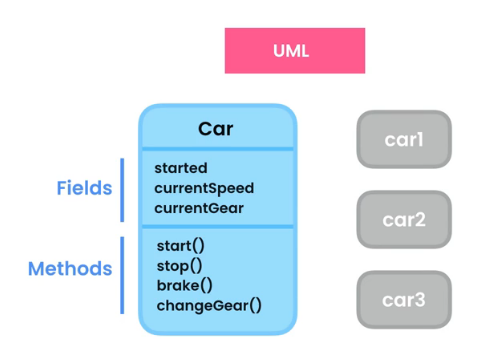
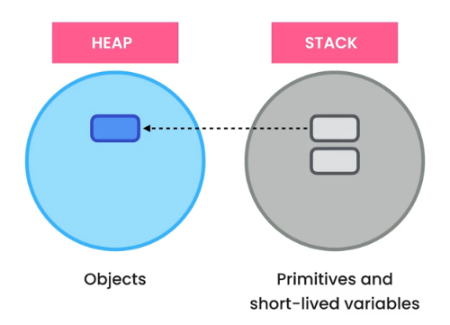

<h1>Java Object Oriented Programming</h1>


<h2>Introduction</h2>

In Computer Science we have various programming paradigms or styles:



Out of all this, functional and object oriented are the most popular ways. These are styles of writing code, they are not programming languages but we classify programming languages based on the paradigms they support.

In object oriented programming, everything is based on the concepts of objects. The objects are units that contain some __data (state)__ and operations on the data called __behavior (methods)__ or functions that modify the data. So in oop you bring together the data and methods that operate on a single object. In functional programming, we take the opposite approach, we assume that data and behavior are fundamentally different, so we keep them separate.



If you ask what is the best paradigm, the answer will be similar to most data related questions, it depends on the problem you are trying to solve.



But as a developer we sometimes favor some frameworks and tools over the other and tend to forget the problem we are trying to solve and use the same tool for all the problems. Which obviously will not work, re read the problem solving definition and keep in mind. So, back to the question which paradigm is better, some people claim that oop is often a better choice for crating graphical user interfaces and games while functional programming makes more sense for functions that require high level of reliability or problems that involve messages being passed around and getting transformed along the way, but remember that this is just basic guidelines and these are not hard and fast rules.


<h2>Classes</h2>

The words classes and objects are often used interchangeably. But they are fundamentally different. A class is a blueprint or a template for creating object. For example, let's look at a Car class using UML diagrams:



Here we have shown the attributes under fields, which are like variables and the behavior under methods. So based on this template, we can create many instances like car1, cat2 etc. All of these car objects will have the same fields and methods but they are independent of each other.

In Java we add classes in new files.

```java
// We create a TextBox class in a different file
public class TextBox {
    public String text; // Field

    // Methods:
    public void setText(String text) {
        this.text = text;
    }

    public void clear(){
        text = "";
    }
}


// Main Class
public class Main {
    public static void main(String[] args) {
        var textBox1 = new TextBox(); // Creating and Initiating a new instance of TextBox class
        textBox1.setTex("Box 1");
        System.out.println(textbox1.text); // "Box 1"
        System.out.println(textbox1.text.toUpperCase()); // "BOX 1"

        var textBox2 = new TextBox();
        textBox2.setText("Box 2"); // "Box 2"
    }
}
```

<h3>Memory Allocation</h3>

Java manages two different areas of the memory, one is called the __heap__ and this is where it stores it's objects, the other area is called the __stack__, and this is where it stores short lived variables like all the primitives as well as the variables that store references to objects on the heap.



When Java runtime executes the following code:

```java
public class Main {
    public static void main(String[] args) {
        var textBox1 = new TextBox(); // Creating and Initiating a new instance of TextBox class
    }
}
```

It will first evaluate what we have on the right side of the assignment operator (`new TextBox()`) and it will create an object and store it on the heap. Let's say the address of this object on the heap is 100. Then Java runtime is going to execute this other part of the code. Here it will allocate some memory on the stack and in this memory location it will store the address of our `TextBox()` object on the heap. So the variable `textBox1` is referencing an object on the heap, that's why we refer to these variables as _reference types_, because these variables don't store the actual values.

Primitive types on the other hand are different. WHen we declare an integer, that integer is stored on the stack and the value that we have in that variable will be stored in that memory location.

In Java unlike C++ we we don't have to worry about deallocating memory. Java will automatically take care of that. This works by when we exit a method, Java runtime will immediately remove all the variables that are stored in the stack.

Let's get back to our example code, if the reference gets removed from the stack, what happens to our object that we stored in the heap, which now doesn't have a reference. These objects in the heap, if it becomes unused for a certain period of time, there is a process that watches the objects on the heap and that process will automatically remove those objects on the heap. This is called _garbage collection_.

<h3>Procedural Programming</h3>

Procedural paradigm is the paradigm that we had before object orientation and its based on procedure or function calls.

Below is a program to calculate the wage of employees.

```java
public class Main {
    public static void main(String[] args) {
        int baseSalary = 50_000;
        int extraHours = 10;
        int hourlyRate = 20;

        int wage = calculateWage(baseSalary, extraHours, hourlyRate);
        System.out.println(wage);
    }

    public static in calculateWage(int baseSalary, int extraHours, int hourlyRate) {
        return baseSalary + (extraHours*hourlyRate);
    }
}
```

Technically there is nothing wrong with the above code because this is a very simple program. However imagine a situation where we extend this program, if we add more features with this style of programming we'll end up with a very fat main method, yeah we can still extract certain methods and put them in other methods but still the main method will be bloated. This is what we call procedural programming. We don't really have classes and objects, we have a bunch of variables and a bunch of functions also called procedures. But this doesn't mean you could throw in a bunch of methods in different classes and call it object oriented programming, oop is much more than that.

<h3>Encapsulation</h3>

Encapsulation means that we should bundle the data and methods that operate on the data inside a single unit or object.

In the Employee program we looked at above, we were storing some data inside three variables in the main method. These variables are local to the method so they are not accessible outside this method, on the other hand we have a calculate wage method, so we passing those variables as arguments to this method. So here we should follow the encapsulation principle and bundle these variables in this method inside a single unit. The code below shows this:

```java
// Let's add a new Employee class to encapsulate the variables
public class Employee {
    public int baseSalary;
    public int hourlyRate;
    // public int extraHours; if let's say extra hours changes every month, then into calculateWage we add extraHours as a parameter

    public int calculateWage(int extraHours) {
        return baseSalary + (extraHours*hourlyRate);
    }
}


// Main class
public class Main {
    public static void main(String[] args) {
        var employee = new Employee();
        employee.baseSalary = 50_000;
        employee.hourlyRate = 20;

        int wage = employee.calculateWage(10);
        System.out.println(wage);
    }
}
```

With these changes out main class is cleaner, it's easier to maintain but we not done yet. This code has an issue and we will look into that next.

<h3>Getters and Setters</h3>

Getters and Setters are very common in Java, it lets users get and set values that can otherwise compromise your program. For example, the issue with our Employee wage code was that if we let anyone set `baseSalary`, someone can potentially add a negative `baseSalary`, which should not happen, of-course we can write an if statement to prevent this but we will have to write it at every location we call the base salary, so what we will do is change the public `baseSalary` to private so the variable is not accessible outside the class.

The following code shows this modification and a getter method that will then let us print the base salary value.

```java
// Encapsulated Employee class
public class Employee {
    private int baseSalary; // Changing to private, we won't be able to access this outside of the Employee class
    public int hourlyRate;

    public int calculateWage(int extraHours) {
        return baseSalary + (extraHours*hourlyRate);
    }

    public void setBaseSalary(int baseSalary) {
        if (baseSalary <= 0) {
            throw new IllegalArgumentException("Salary Can't be zero or less");
        }
        else {
            this.baseSalary = baseSalary;
        }
    }

    public int getBaseSalary() {
        return baseSalary;
    }
}


// Main class
public class Main {
    public static void main(String[] args) {
        var employee = new Employee();
        employee.hourlyRate = 20;

        employee.setBaseSalary(50_000); // We set the employee base Salary
        System.out.println(employee.getBaseSalary()); // We print out the base Salary using the get method

        int wage = employee.calculateWage(10, baseSalary, hourlyRate);
        System.out.println(wage);
    }
}
```

<h3>Abstraction</h3>

Abstraction means we should reduce complexity by hiding unnecessary details in the classes.

<h3>Coupling</h3>

Coupling is how much a class is dependent upon or coupled to another class.

Our `Main class` is dependent on the Employee class, this isn't a bad thing but think if we initially set an Employees name to one and then we want to change it, we have to change it over here and recompile our code. The other two are the `baseSalary` and the `hourlyRate`, in them we created two getter methods, we aren't actually using them but if you don't have a requirement to use these methods, it's better to hide or delete them, so let's make the getter methods private.

```java
// Encapsulated Employee class
public class Employee {
    private int baseSalary;
    private int hourlyRate;

    public int calculateWage(int extraHours) {
        return baseSalary + (extraHours*hourlyRate);
    }

    public void setBaseSalary(int baseSalary) {
        if (baseSalary <= 0) {
            throw new IllegalArgumentException("Salary Can't be zero or less");
        }
        else {
            this.baseSalary = baseSalary;
        }
    }

    public void setHourlyRate(int hourlyRate) {
        if (hourlyRate <= 0) {
            throw new IllegalArgumentException("Hourly Rate Can't be zero or less");
        }
        else {
            this.hourlyRate = hourlyRate;
        }
    }

    private int getBaseSalary() {
        return baseSalary;
    }

    private int getHourlyRate() {
        return hourlyRate;
    }
}


// Main class
public class Main {
    public static void main(String[] args) {
        var employee = new Employee();
        employee.setBaseSalary(50_000);
        employee.setHourlyRate(20);

        int wage = employee.calculateWage(10, baseSalary, hourlyRate);
        System.out.println(wage);
    }
}
```

<h3>Reducing Coupling</h3>

Let's say we want to build a `Browser class`:

```java
// Browser Class
public class Browser {
    public void navigate(String address) {
        // As part of this we need to first find the ip address of the website and let's assume this is more than 5 lines of code.

        // The following method finds a ip for us
        String ip = findIpAddress(address);

        // Next we need to get the content of the homepage of this website
        String httml = sendHttpRequest(ip);

        System.out.println(httml)
    }

    private String findIpAddress(String address) {
        return "127.0.0.1";
    }

    private String sendHttpRequest(String ip) {
        return "<html></html>";
    }
}


// Main Class
public class Main {
    public static void main(String[] args) {
        var browser = new Browser();
        // findIpAddress and sendHttpRequest are implementation details, we don't really need them in the main class, that's why we have it as private instead of public.
        // So if we change these two methods, our main class will remain unaffected.

        browser.findIpAddress();
    }
}
```

<h3>Constructors</h3>

What if we forget to call the `baseSalary` and `hourlyRate` in Main, then our program will start with zero, so we want to prevent it. We do this by creating a constructor. A constructor is a special method that is called when we create a new object. The job of a default constructor is to initialize our fields to our default values, so numbers are going to be 0, booleans are going to be false, and reference types are going to be null.

```java
// Encapsulated Employee class
public class Employee {
    private int baseSalary;
    private int hourlyRate;

    // Creating a custom constructor so Java doesn't create the default constructor for us
    public Employee(int baseSalary, int hourlyRate) {
        // We can do this two ways, one by using a this.baseSalary = baseSalary but this can cause our state to start with an invalid state if the user passes a 0 or a negative value.
        // So we will use our setter methods that will throw an exception if you tried to create an employee object with invalid values
        setBaseSalary(baseSalary);
        setHourlyRate(hourlyRate);
    }

    public int calculateWage(int extraHours) {
        return baseSalary + (extraHours*hourlyRate);
    }

    // If we don't want the user to be able to change the base salary and the hourly rate we can apply abstraction and make the following private
    private void setBaseSalary(int baseSalary) {
        if (baseSalary <= 0) {
            throw new IllegalArgumentException("Salary Can't be zero or less");
        }
        else {
            this.baseSalary = baseSalary;
        }
    }

    private void setHourlyRate(int hourlyRate) {
        if (hourlyRate <= 0) {
            throw new IllegalArgumentException("Hourly Rate Can't be zero or less");
        }
        else {
            this.hourlyRate = hourlyRate;
        }
    }

    private int getBaseSalary() {
        return baseSalary;
    }

    private int getHourlyRate() {
        return hourlyRate;
    }
}


// Main class
public class Main {
    public static void main(String[] args) {
        // Since we have a custom constructor that expects two arguments we have to change our Employee class like so:
        var employee = new Employee(50_000, 20);

        int wage = employee.calculateWage(10, baseSalary, hourlyRate);
        System.out.println(wage);
    }
}
```

<h3>Method Overloading</h3>

In out `calculateWage` method we are explicitly passing the overtime hours but what if an employee doesn't work any extra hours? One way is to create a different implementation so that calculateWage doesn't take any parameters `calculateWage()`. This is called Method Overloading. A method overloading means creating different implementations of it with different parameters.

```java
// Encapsulated Employee class
public class Employee {
    private int baseSalary;
    private int hourlyRate;

    public Employee(int baseSalary, int hourlyRate) {
        setBaseSalary(baseSalary);
        setHourlyRate(hourlyRate);
    }

    public int calculateWage(int extraHours) {
        return baseSalary + (extraHours*hourlyRate);
    }

    // This is one way to solve the problem
    public int calculateWage() {
        return baseSalary;
    }

    // This is another way to solve the problem, using 0 as the argument. We have overloaded the calculateWage method by creating two implementations.
    // In Python you can do this by setting default value, in Java, you can't do that
    public int calculateWage() {
        return calculateWage(0);
    }

    private void setBaseSalary(int baseSalary) {
        if (baseSalary <= 0) {
            throw new IllegalArgumentException("Salary Can't be zero or less");
        }
        else {
            this.baseSalary = baseSalary;
        }
    }

    private void setHourlyRate(int hourlyRate) {
        if (hourlyRate <= 0) {
            throw new IllegalArgumentException("Hourly Rate Can't be zero or less");
        }
        else {
            this.hourlyRate = hourlyRate;
        }
    }

    private int getBaseSalary() {
        return baseSalary;
    }

    private int getHourlyRate() {
        return hourlyRate;
    }
}


// Main class
public class Main {
    public static void main(String[] args) {
        var employee = new Employee(50_000, 20);
        int wage = employee.calculateWage(10, baseSalary, hourlyRate);
        System.out.println(wage);
    }
}
```

<h3>Constructors Overloading</h3>

We can also overload constructors similar to method because technically constructors are also methods.

Lets say some of our employees have a base salary and they can also do extra hours, but we also have other types of employees that don't do extra hours, so we don't want to pass this second argument, one way is to pass in 0, the other is to overload this constructor:

```java
// Encapsulated Employee class
public class Employee {
    private int baseSalary;
    private int hourlyRate;

    public Employee(int baseSalary, int hourlyRate) {
        setBaseSalary(baseSalary);
        setHourlyRate(hourlyRate);
    }

    // This is one way to do it
    public Employee(int baseSalary) {
        setBaseSalary(baseSalary);
        setHourlyRate(0);
    }

    // This is another better way to do the above
    public Employee(int baseSalary) {
        this(baseSalary, 0);
    }

    public int calculateWage(int extraHours) {
        return baseSalary + (extraHours*hourlyRate);
    }

    public int calculateWage() {
        return calculateWage(0);
    }

    private void setBaseSalary(int baseSalary) {
        if (baseSalary <= 0) {
            throw new IllegalArgumentException("Salary Can't be zero or less");
        }
        else {
            this.baseSalary = baseSalary;
        }
    }

    // Note we changed the <= to < because hourly rate can be 0
    private void setHourlyRate(int hourlyRate) {
        if (hourlyRate < 0) {
            throw new IllegalArgumentException("Hourly Rate Can't less than zero");
        }
        else {
            this.hourlyRate = hourlyRate;
        }
    }

    private int getBaseSalary() {
        return baseSalary;
    }

    private int getHourlyRate() {
        return hourlyRate;
    }
}


// Main class
public class Main {
    public static void main(String[] args) {
        // We can create an Employee object with two arguments or a single argument
        new Employee(50_000);
        var employee = new Employee(50_000, 20);

        int wage = employee.calculateWage(10, baseSalary, hourlyRate);
        System.out.println(wage);
    }
}
```

<h3>Static Members</h3>

In object oriented programming a class can have two types of members, __instance members__ and __static members__. Instance members belong to instance or object.

For example in our employee class all the `baseSalary` and `hourlyRate` are _instance members_, they belong to each instance of the employee class. So, when we create an employee object, you can access these members using the dot operator. In contrast we have _static members_ or _class members_. These are the fields and methods that belong to a class, not an object, for example the `Employee` class, if you use the dot operator you won't see anything because this class doesn't have any static fields or methods.

So, when do we use the static members? We use them in situations where we want to represent a concept tht should be in a single place. Like `numberOfEmployees`. This concept doesn't belong to each individual employee. For example:

```java
// Encapsulated Employee class
public class Employee {
    private int baseSalary;
    private int hourlyRate;

    public static int numberOfEmployees;

    // Each time we create a new Employee instance, we need to increase the numberOfEmployees:
    public Employee(int baseSalary, int hourlyRate) {
        setBaseSalary(baseSalary);
        setHourlyRate(hourlyRate);
        numberOfEmployees++;
    }

    public Employee(int baseSalary) {
        this(baseSalary, 0);
        numberOfEmployees++;
    }

    // We can also create a static method:
    public static void printNumberOfEmployees() {
        System.out.println(numberOfEmployees)
    }

    public int calculateWage(int extraHours) {
        return baseSalary + (extraHours*hourlyRate);
    }

    public int calculateWage() {
        return calculateWage(0);
    }

    private void setBaseSalary(int baseSalary) {
        if (baseSalary <= 0) {
            throw new IllegalArgumentException("Salary Can't be zero or less");
        }
        else {
            this.baseSalary = baseSalary;
        }
    }

    private void setHourlyRate(int hourlyRate) {
        if (hourlyRate < 0) {
            throw new IllegalArgumentException("Hourly Rate Can't less than zero");
        }
        else {
            this.hourlyRate = hourlyRate;
        }
    }

    private int getBaseSalary() {
        return baseSalary;
    }

    private int getHourlyRate() {
        return hourlyRate;
    }
}


// Main class
public class Main {
    public static void main(String[] args) {
        var employee = new Employee(50_000, 20);
        int wage = employee.calculateWage(10, baseSalary, hourlyRate);
        System.out.println(wage);

        Employee.printNumberOfEmployees(); // print number of employees
    }
}
```

Note:
- static fields doesn't have to create an object, we can access them directly through the class (`Employee.numberOfEmployees`)
- static methods only see other static methods, they don't have access to instance members.


<h2>Inheritance</h2>


<h2>Interfaces</h2>
